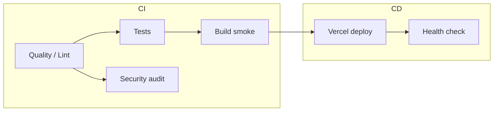

# CI/CD — RentDirect (MRM Rental Manager)

Professional GitHub Actions pipelines run in **each repository** independently. Workflow file: `.github/workflows/ci-cd.yml`.

## Overview

| Repository | Workflow | CI (every push / PR) | CD (production) |
|------------|----------|----------------------|-----------------|
| **Backend** | `Backend CI/CD` | Quality, pytest, pip-audit, Docker smoke | Vercel API (`main` / manual) |
| **Frontend** | `Frontend CI/CD` | ESLint, production build, npm audit | Vercel web (`main` / manual) |
| **Mobile** | `Mobile CI/CD` | Format, analyze, tests, web + APK smoke | Vercel mobile web (`main` / manual) |

**Branches:** `main`, `master`, `develop`, `feature-fix`  
**Concurrency:** in-flight runs for the same ref are cancelled when a newer commit is pushed.

## Pipeline architecture



### Continuous integration (all branches)

- **Backend:** `compileall` on `app/` + `api/`, import smoke, full `pytest` suite (SQLite, mock payments), optional `pip-audit`, Docker image build (no push).
- **Frontend:** `npm ci` with **npm 10.8.2** (lockfile must match CI npm), ESLint, `vite build`, artifact upload (`dist/`).
- **Mobile:** `dart format` check (informational), `flutter analyze`, `flutter test`, release **web** build, optional **debug APK** (Play Store release still needs local signing).

### Continuous deployment (`main` / `master` only)

Deploy jobs use the [Vercel Action](https://github.com/amondnet/vercel-action) when these **repository secrets** are set:

| Secret | Description |
|--------|-------------|
| `VERCEL_TOKEN` | Vercel personal/team token |
| `VERCEL_ORG_ID` | Team or user ID |
| `VERCEL_PROJECT_ID` | Project ID for **this** repo |

If secrets are missing, the deploy job **still succeeds** with a notice — production can continue via **Vercel ↔ GitHub** auto-deploy.

**Manual deploy:** Actions → workflow → **Run workflow** → enable **Deploy to Vercel production**.

### Production URLs

| App | URL |
|-----|-----|
| API | https://mrm-rental-manager-backend.vercel.app |
| Web | https://mrm-rental-manager-frontend-pink.vercel.app |
| Mobile web | https://mrm-rental-manager-mobile.vercel.app |

Post-deploy, the backend workflow calls `/api/v1/platform/readiness` when Vercel secrets are configured.

## Enable on GitHub

1. Push `.github/workflows/ci-cd.yml` (and `dependabot.yml`) to each repo.
2. Open **Actions** — workflows run on the next push or PR.
3. **Branch protection (recommended):** require status checks before merge:
   - Backend: `Tests`, `Docker build smoke`
   - Frontend: `Production build`
   - Mobile: `Unit & widget tests`, `Web release build`
4. Add Vercel secrets (optional if using Vercel dashboard linking).
5. Create a **production** environment in GitHub (Settings → Environments) for approval gates if desired.

## Dependabot

Each repo includes `.github/dependabot.yml` for weekly updates to:

- Application dependencies (pip / npm / pub)
- GitHub Actions versions

## Local commands (mirror CI)

### Backend

```bash
cd MRM-Rental-Manager-Backend-
export PYTHONPATH=.
export ENVIRONMENT=test
export SECRET_KEY=ci-secret-key-for-github-actions-only-32chars
export DATABASE_URL=sqlite:///./ci_test.db
export SKIP_STARTUP_MIGRATIONS=true
export PAYMENT_ALLOW_MOCK=true
export PAYMENT_GATEWAY_PROVIDER=mock
pip install -r requirements.txt -r requirements-dev.txt
python -m compileall -q app api
python -m pytest tests -q
```

### Frontend

Use **Node 22** and **npm 10.8.x** (not npm 11 — lockfile is generated for npm 10):

```bash
cd MRM-Rental-Manager-Frontend-
npx npm@10.8.2 ci
npm run build
```

### Mobile

```bash
cd MRM-Rental-Manager-Mobile-
flutter pub get
dart format --output=none --set-exit-if-changed lib test
flutter analyze --no-fatal-infos --no-fatal-warnings
flutter test
flutter build web --release \
  --dart-define=API_BASE_URL=https://mrm-rental-manager-backend.vercel.app \
  --dart-define=SUI_NETWORK=testnet
```

## Play Store / App Store

CI builds a **debug APK** as a smoke test only. Signed AAB/IPA releases are **out of scope** for this workflow — use local release builds or a dedicated release workflow with signing secrets (`ANDROID_KEYSTORE`, `APPLE_CERTIFICATE`, etc.).

## Troubleshooting

| Issue | Fix |
|-------|-----|
| Frontend `npm ci` — missing `zod@3.25.76` | Regenerate lock with `npx npm@10.8.2 install`, commit `package-lock.json` |
| Backend `No module named 'app'` | Set `PYTHONPATH=.` or use `python -m pytest` (already in workflow) |
| `@mysten/sui` engine warning | CI uses Node 22 |
| Vercel deploy skipped | Add secrets or connect repo in Vercel dashboard |
| ESLint fails on frontend | Fix over time; PRs allow lint to fail, `main` should pass eventually |

## Legacy workflow

The old single-job `ci.yml` files were replaced by `ci-cd.yml`. Update branch protection rules to reference the new job names.
